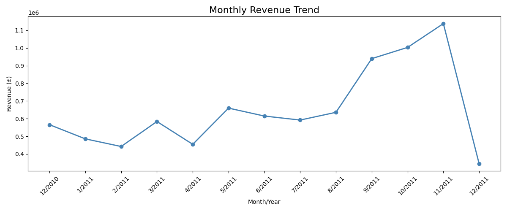
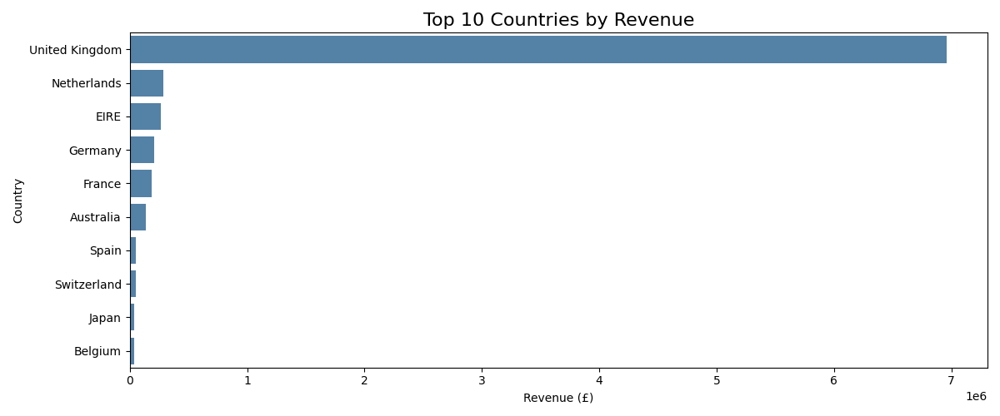
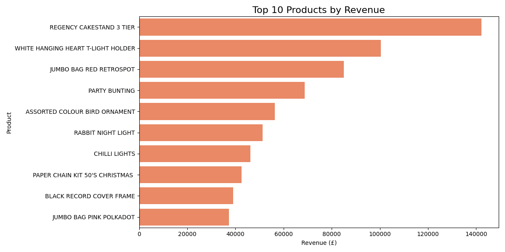

# E-Commerce Data Analysis

Analyzing UK-based online retail transactions (Dec 2010 - Dec 2011) using Python and SQL.

## Business Insights
- UK generates 82.3% of total revenue (£6,959,872)
- November is peak month at £1,137,664 — 2.6x higher than February
- Top 20% of customers generate 73.8% of total revenue (Pareto Principle)
- 34.7% of customers only bought once — major retention opportunity

## Charts

## Dataset
- Source: Kaggle — E-Commerce Data by carrie1
- 541,909 raw transactions cleaned down to 391,295
- 4,334 unique customers across 37 countries

## Tools Used
- Python (Pandas, NumPy, Matplotlib, Seaborn)
- SQLite for SQL analysis
- Jupyter Notebook

## Key Results
| Metric | Value |
|---|---|
| Total Revenue | £8,459,455 |
| Total Customers | 4,334 |
| Total Orders | 18,413 |
| Avg Order Value | £459.43 |
